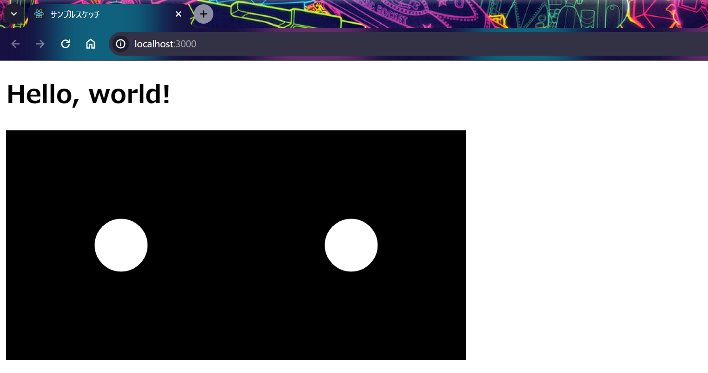
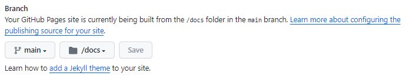
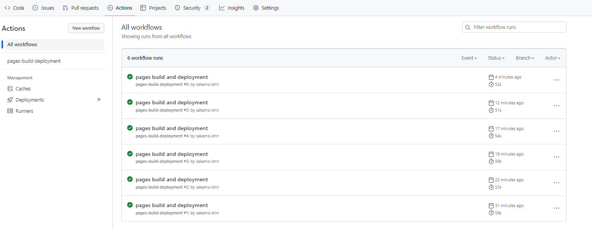
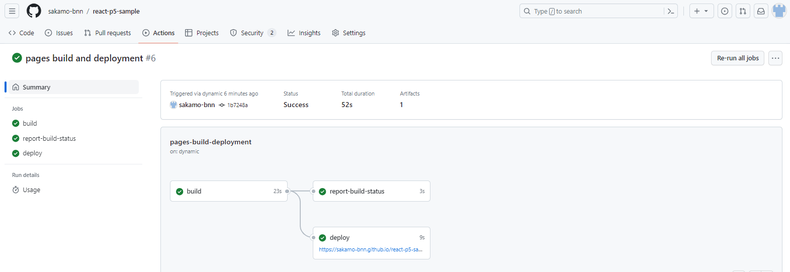

# How to develop Project with React and p5.js
This repository shows the steps to use p5.js in a React app.

You can develop your project using React and p5.js by following these steps. 
1. Building a basic React project
2. Introduction of p5.js

日本語での解説は Qiita にて公開していますので、こちらをご確認ください。
- [Reactでp5.jsを使う手順](https://qiita.com/skm_bnn/private/5ede253d469bad566c4b)

# Building a basic React project
Before introducing p5.js, check whether the basic environment of React app is in place.

## Making ````package.json````
First, create ````package.json````. This file will be used to manage the project.

```shell
npm init -y
```

Next, write the following content in ````package.json```` with your favorite text editor. Please change the ````PROJECT_NAME```` to suit your own content.

```json:package.json
{
  "name": "PROJECT_NAME",
  "version": "1.0.0",
  "description": "",
  "main": "index.js",
  "scripts": {
    "start": "react-scripts start",
    "build": "react-scripts build",
    "test": "react-scripts test",
    "eject": "react-scripts eject"
  },
  "keywords": [],
  "author": "",
  "license": "ISC",
  "dependencies": {
    "react": "^18.2.0",
    "react-dom": "^18.2.0",
    "react-scripts": "^5.0.1"
  }
}
```

## Installing core React packages
Install the required packages for your React project with the following command:

```shell
npm install react react-dom react-scripts
```

## Creating files and source files
Let's build the project directory. The commands for Windows and Mac are shown here, but you can also create folders and files manually using the GUI (Explorer or Finder).

-  windows
```shell
mkdir public
New-Item ./public/index.html -type file
mkdir src
New-Item ./src/index.js -type file
New-Item ./src/App.js -type file
```

- mac (Operation not confirmed)
```shell
mkdir public
touch public/index.html
mkdir src
touch src/index.js
touch src/App.js
```

## Edit source file
Change the source file you created earlier as follows.

### ```index.html```
```html: index.html
<!DOCTYPE html>
<html lang="ja">

  <head>
    <meta charset="UTF-8">
    <title>Sample Sketch</title>
  </head>

  <body>
    <div id="root"></div>
  </body>

</html>
```

### ```index.js```
```jsx: index.js
import React from 'react';
import ReactDOM from 'react-dom/client';

import App from './App';

const root = ReactDOM.createRoot(document.getElementById('root'));

root.render(
  <React.StrictMode>
    <App />
  </React.StrictMode>
);

```

### ```App.js```
```jsx: App.js
function App() {
  return (
    <div className="App">
      <h1>Hello, world!</h1>
    </div>
  );
}

export default App;
```

## Operation confirmation
You can see your React app working with the following command:

```shell
npm start
```

It is successful if the following content is output.

```shell
Compiled successfully!

You can now view react-p5-sample in the browser.

  Local:            http://localhost:3000
  On Your Network:  http://192.168.56.1:3000

Note that the development build is not optimized.
To create a production build, use npm run build.

webpack compiled successfully
```

After a while, the browser will start up. It is a success if the launched page displays "Hello, world!" as shown below.


You can stop the operation by following the steps below.
1. Push ```Ctrl + C``` 
1. You can see the following output in the terminal, so type ```y```
  ```
  Compiled successfully!

  You can now view react-p5-sample in the browser.

    Local:            http://localhost:3000
    On Your Network:  http://192.168.56.1:3000

  Note that the development build is not optimized.
  To create a production build, use npm run build.

  webpack compiled successfully
  ```

# Introduction of p5.js
Before writing sketches freely, let's check whether the basic operations of p5.js can be executed.

## Installing the package
You can install the package ````react-p5```` with the following command.

```shell
npm install react-p5
```

## p5.js source file
Create a source file containing the p5.js program in the ````src```` folder. Please set the source file name as you like. 

React file names often match component names. You can set the component name as you like, but please keep the following points in mind.

- The first letter starts with a capital letter
   - PascalCase (when multiple words are connected, the first letter is capitalized) is common
- Match file name
   - This is just a convention, so if there is nothing you can do, you don't have to meet it.
- Existing component names cannot be used
   - Example: ```Sketch``` is defined in ```react-p5```

Here, the file name is ```SampleSketch.js```, and the component name is ```SampleSketch```. We will write the p5.js drawing process in this ```SampleSketch``` component.

```jsx: SketchComponent.js
import Sketch from "react-p5";

export default function SampleSketch(props) {
  const setup = (p5, canvasParentRef) => {
    p5.createCanvas(300, 300).parent(canvasParentRef);
  };

  const draw = (p5) => {
    p5.background(0);
    p5.ellipse(150, 150, 70, 70);
  };

  return <Sketch setup={setup} draw={draw} />;
};
```

Basically, you can draw any sketch by changing the contents of the ```setup()``` function and ```draw()``` function. Please note that variables, functions, classes, etc. implemented in p5.js must be written following <INS>```p5.```</INS>. Here's a simple example:
|Example|Code|
|---|---|
|Canvas width | ```p5.width```|
|generation of Vector class| ```p5.createVector(1, 2)```|

To use the ```SampleSketch``` component, change the contents of ```App.js``` as follows.

```jsx: App.js
import SampleSketch from "./SampleSketch"

function App() {
  return (
    <div className="App">
      <h1>Hello, world!</h1>

      <SampleSketch />
    </div>
  );
}

export default App;
```

## Operation confirmation
You can check the operation of your React app using the same command as above.
```shell
npm start
```

It is a React specification that two canvases appear. I will give a brief explanation later.



As a solution to the problem of having two canvases, there is a way to temporarily change the rendering settings.

- Change before
```jsx: index.js (end of file)
root.render(
  <React.StrictMode>
    <App />
  </React.StrictMode>
);
```
- After change
```jsx: index.js (end of file)
root.render(
  <App />
);
```

The following is the behavior of the modified code.


When building on Github pages, there is no problem with the code before the change.

# Deploy to Github Pages
Here are the steps to publish an app on Github Pages. The information in reference [1] was very helpful.

## Editing ```package.json```
Change the values of the ```homepage```, ```scripts``` fields. Please change the ```ACCOUNT_NAME``` and ```REPOSITORY_NAME``` of ```homepage``` to match your own content.

```json:package.json
  <Omitted>
  "homepage": "https://ACCOUNT_NAME.github.io/REPOSITORY_NAME/",
  "scripts": {
    "start": "react-scripts start",
    "build": "react-scripts build",
    "test": "react-scripts test",
    "eject": "react-scripts eject",
    "rm": "rm -rf docs",
    "mv": "mv build docs",
    "git": "git add . && git commit && git push origin main",
    "deploy": "npm run rm && npm run build && npm run mv && npm run git"
  },
  <Omitted>
```

## Deploy
You can ```push``` to the repository with the following command: Please note that on Windows, you need to prepare an environment where the ```rm``` command can be executed. As an example environment, you can run it on a terminal in ````Git Bash````.

```shell
npm run deploy
```

The following log is output.

```
> PROJECT_NAME@1.0.0 git
> git add . && git commit && git push origin main

warning: in the working copy of 'docs/asset-manifest.json', LF will be replaced by CRLF the next time Git touches it
warning: in the working copy of 'docs/static/js/main.98587e68.js', LF will be replaced by CRLF the next time Git touches it
warning: in the working copy of 'docs/static/js/main.98587e68.js.LICENSE.txt', LF will be replaced by CRLF the next time Git touches it
hint: Waiting for your editor to close the file...
```

A ```docs``` folder will now be created. It will also automatically open ```COMMIT_EDITMSG``` in some text editor such as VSCode.

```:COMMIT_EDITMSG 
# Please enter the commit message for your changes. Lines starting
# with '#' will be ignored, and an empty message aborts the commit.
#
# On branch main
# Your branch is up to date with 'origin/main'.
#
# Changes to be committed:
# < Changes continue below... >
```

Remove the ```#``` from the line after ```< Changes continue below... >```, save, and close the editor. The changes will now be reflected on Github (no ```commit``` or ```push``` operations are required after executing this command).

# Configuring the repository
## Scope of repository disclosure
Set the repository's public scope using the following steps.
1. Open the repository page on the Github website
2. Make the repository ```public``` from ```[Setting > General > Danger Zone]```

## Setting up Github Pages
In ```[Setting > Pages > GitHub Pages > Build and deployment > Branch]```, set ```Branch``` to ```main``` and ```folder``` to ```docs``` respectively.



## Check operation
A checkmark under ```[Actions > All worksflows]``` indicates that the deployment is complete.



Click the appropriate operation to display the following screen.



You can check the operation by clicking the URL under ```deploy```.


If you make changes to the project, run the ```npm run deploy``` command again to deploy them, and the changes will be reflected.


## Supplement: About importing files in p5.js
I stumbled upon trying to create a shader object with the ```loadShader()``` function, so I'll leave a record.
In conclusion, the problem can be solved by using the ```import``` statement instead of simply managing file paths with strings or variables. It is unconfirmed whether other load-related functions ( ```loadImage()```` ) are similar.

### Failure example
I am passing the file path to the ```p5.loadShader()``` function in ```preload```, but it is not loading properly.

```JSX: Failure example with shader
import React from "react";
import Sketch from "react-p5";

export default function SampleSketch(props) {
  let theShader;

  const preload = (p5) => {
    theShader = p5.loadShader("./main.vert", "./main.frag");
  }

  const setup = (p5, canvasParentRef) => {
    p5.resizeCanvas(400, 400, p5.WEBGL).parent(canvasParentRef);
  };

  const draw = (p5) => {
    p5.shader(theShader);

    p5.rect(0, 0, p5.width, p5.height);
  };

  return <Sketch
    preload={preload}
    setup={setup}
    draw={draw}
  />;
};
```

### success story
When I specified the file path with ```import```, it worked without any problems.
```jsx: Example of successful shader operation
import React from "react";
import Sketch from "react-p5";

import VERT_FILE from "./main.vert"
import FRAG_FILE from "./main.frag"

export default function SampleSketch(props) {
  let theShader;

  const preload = (p5) => {
    theShader = p5.loadShader(VERT_FILE, FRAG_FILE);
  }

  const setup = (p5, canvasParentRef) => {
    p5.resizeCanvas(400, 400, p5.WEBGL).parent(canvasParentRef);
  };

  const draw = (p5) => {
    p5.shader(theShader);

    p5.rect(0, 0, p5.width, p5.height);
  };

  return <Sketch
    preload={preload}
    setup={setup}
    draw={draw}
  />;
};
```


# Reference Web Site
- [1] [ ReactをGitHub Pagesにデプロイしよう](https://qiita.com/tat_mae084/items/745761eee6cd1d42949d
)
